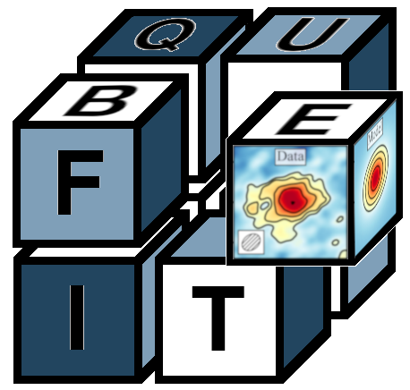

# Qubefit

Qubefit is a python-based code designed to fit models to astronomical observations that yield three dimensional 'data cubes'. These 'data cubes' consist out of two spatial directions and one spectral, and are the end products of both radio / (sub-)millimeter interferometry observations, as well as observations with integral field units in the optical and near-infrared. Qubefit was specifically designed to model the emission from high redshift galaxies, for which the emission is only barely resolved and the resolution of the observations, which is known as the point spread function (PSF) or the beam, substantially affects the emission (often called beam-smearing).

  

Currently there are several packages available that can model the emission from high redshift **disk** galaxies. However, for some high redshift galaxies this might not be a good assumption. Some galaxies might not show any sign of rotation, while other galaxies are actually multiple merging clumps. Modeling these galaxies with disks could bias observations by erroneously fitting disks to objects that might not be disks at all. Qubefit has several non-disk like models, and other user-defined models can easily be added into the code. This can help assess if galaxy emission truly arises from disks or if other configurations can also reproduce the observed emission.

Qubefit uses a fully Bayesian framework to explore the multi-dimension parameter space and find the best fit parameters and uncertainties. It does this by applying the affine invariant Markov Chain Monte Carlo (MCMC) ensemble sampler via the [emcee](https://emcee.readthedocs.io/en/stable/ "Emcee Documentation") package. Although this fully Bayesian approach comes with a price in computational speed, it is relatively robust to the choice of priors and initial guesses.

Within the code, there are several convenience functions defined to assess the results of the fitting routine, as well as to assess the kinematics of the data, such as moment images and positon-velocity diagrams. Full documentation for the use of the code, including some tutorials are located in the [documentation](https://qubefit.readthedocs.io/en/latest "Documentation for Qubefit").

MIT License, Copyright (c) 2020-2021 Marcel Neeleman
