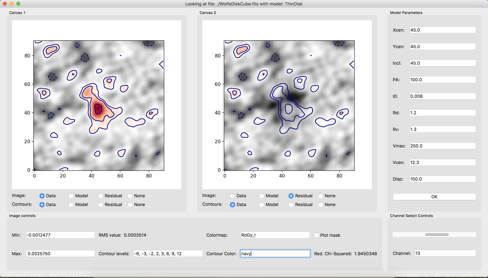

.. _guis:

Graphical User Interfaces
=========================

Qubefit comes with two graphical user interfaces (GUIs). The *qfgui* and the *qubemom* GUI. The first GUI, *qfgui*, can be used to help determine the correct mask and initial parameter guesses before running the fitting procedure. This step is crucial to make sure that the code converges relatively quickly and that the correct data points are used during the fitting routine. The second GUI, *qubemom*, allows you to make different moment images of the data, as well as show the data cube using a simple GUI.

The Qubefit GUI (qfgui)
----------------------------------------------------------
The aim of *qfgui* is to provide a graphical user interface to be able to quickly select decent initial parameters for the fitting procedure. Starting too far away from the best-fit solution would result in a chain not converging very fast, and would unnecessarily lengthen the time for the fitting routine. The GUI can also be used **after** the fitting routine has run, to see how well the best-fit solution reproduces the data. To start the GUI simply type::

  qfgui setupfile.py (arg2)

Here *setupfile.py* is the setup file created for the data cube and the chosen model (see :ref:`exfile`). This file should define the model in a function of the name *set_model()*. This function should only return the full instantiated :ref:`qubefit` instance. The code in addition can take an optional second argument. This string gets directly passed to the *set_model()* function as an argument. This can be useful for customizing a single setup file for multiple objects.

Below is a screenshot of the *qfgui*.

The window contains five different panels. Here is a description of each of the panels;

  * There are two *canvas* panels, which can show different parts of the  :ref:`qubefit` instance, either the data, the model, the residual (data minus the model), or nothing. You can overplot contours of these data as well using the radio buttons at the bottom of the panels.
  * The  *image controls* panel deals with the image properties of the canvases. The minimum and maximum value of the color map (default is set at -3 and 11 times the RMS of the first channel). The RMS value, which is the median of the square root of the variance of each channel. Contour levels to draw. This should be a comma-separated list of increasing numbers. The next two inputs determine the colormap of the image, and the color of the contours. These should be valid ``matplotlib`` `colormap <https://matplotlib.org/3.1.1/gallery/color/colormap_reference.html>`_ and `color <https://matplotlib.org/3.1.0/gallery/color/named_colors.html>`_ names. There is also a check box that toggles the mask used for the fitting procedure. This is very important to check, to make sure that all the emission is captured by the mask, as well as a bit more around the edges to show where the emission drops below the detection threshold. Finally, the last line shows the reduced chi-square statistic for the data, the model and the mask.
  * The *channel select* panel is a simple panel that has a slider and textbox, so you can select the wanted channel or quickly scan through the channels.
  * The *model parameters* panel is populated with all of the parameters that are defined in the model. The initial values are those that are defined in the *setupfile.py* file and are given in the physical units that are defined in this file. You can change each of these values by simply clicking in the box and typing a new value. Note that the code does not check that the values are within the prior ranges set by the code, this is up to you to adhere to. After changing the parameters to your liking, hit the `OK` button and the new model will be generated. Depending on the model and data, this could take a bit (for reasonable models and data cube sizes, normally less than five seconds). Note that hitting the return (or enter) key in each of the text boxes does *NOT* reload the model, only the `OK` button does this.

After you have found an acceptable initial guess, you should copy over the values into the *setupfile.py* file before you close the GUI. If you do this, then next time you load the GUI it should show these values as the new default. If you have run the code and found the best-fit solution, then you can also use this GUI to see how successful the fit was. Simply copy over the best-fit solutions for each parameter into the *model parameters* section, and hit the ``OK`` button.

The Qube Moment GUI (qubemom)
----------------------------------------------------------
The aim of *qubemom* is to provide a quick view of a data cube, and perform some simple kinematic operations such as determining the velocity field and dispersion field. Two methods can be used to calculate these fields, either the first and second moments of the data cube in the spectral direction or through Gaussian fitting of the spectrum at each pixel (see appendix C of the ``reference paper``). For the first method a mask is often defined, in order to only count those pixels detected above a certain noise threshold. For the second method, beware that Gaussian fitting is slow, and you likely will have to wait a few minutes.

The *qubemom* GUI is currently under active development, and should appear in the code shortly. 
