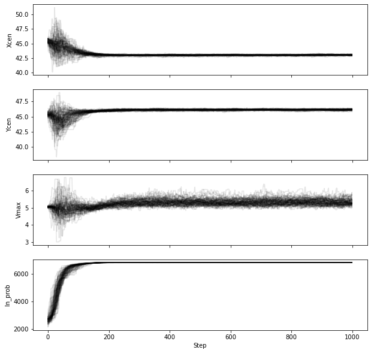
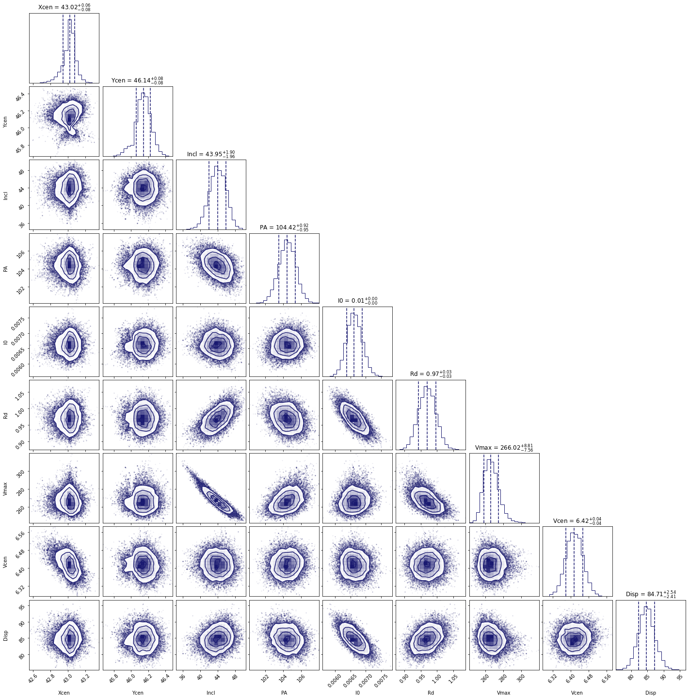
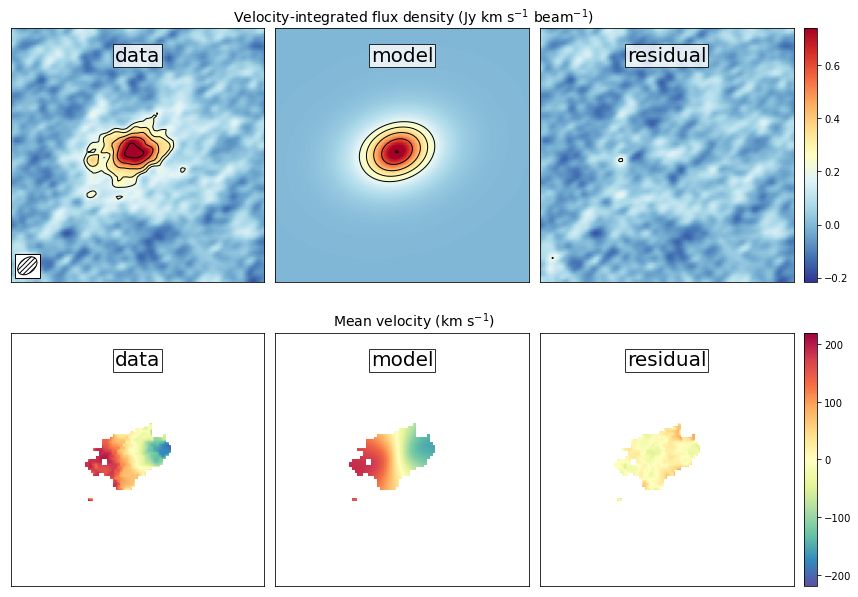
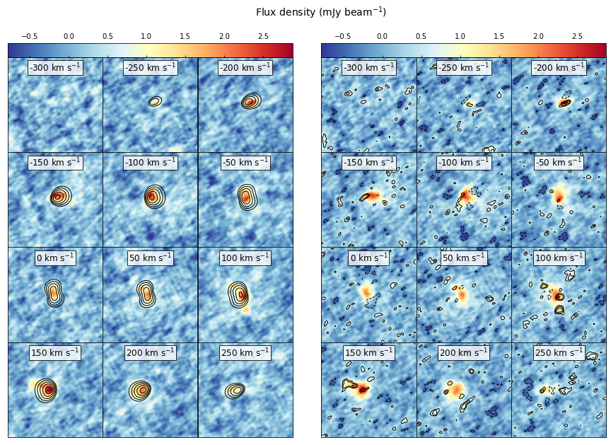

.. \_thindisk:

Note: This tutorial is available as a python notebook
`here <https://github.com/mneeleman/qubefit/blob/master/doc/_static/ThinDisk.ipynb>`__.

Fitting a ThinDisk Model
========================

The goal of this tutorial is to fit a thin disk model to ALMA
observations of a high redshift galaxy. Our scientific aim is to measure
the rotational velocity and dispersion of the galaxy. For the data, we
will be using the full calibrated continuum-subtracted data cube of the
ionized carbon emission from a z=4.26 galaxy (‘the Wolfe disk’)
described in `Neeleman et
al. (2020) <https://arxiv.org/abs/2005.09661>`__. The emission from this
galaxy appears to have a smooth velocity field, which is consistent with
emission emitted by gas within a rotating disk.

To run this example, you will need to have access to the data. Currently
the example file is part of the github code and lives in the
``examples`` folder, because it also is used to verify the code was
installed correctly. This might change in future versions, in which case
you will need to download the file and add it to the examples folder
manually. The fits file ``examples/WolfeDiskCube.fits`` (6MB) is
actually a sub-cube of the full continuum-subtracted data cube, which is
signficantly larger (25MB). For the paper, a slightly different qube was
used with smaller channel spacings, but to save on time we will use this
cube which gives similar results.

Setup the model
---------------

The first step is to slice the cube to a small enough region surrounding
the emission. Calculate or load the variance, load the beam (or PSF) and
setting the mask. The second step is to define the model we wish to use
to fit this modified data cube within the defined mask and define the
initial parameters of the model. Finally we wish to create the model
from our initial parameters. These steps are easiest placed inside a
function. This function can then be placed into a separate file and
loaded with the GUI: ``qfgui``. Below is a repeat of the setup file
``DiskModel.py`` that is in the example folder. For a detailed
description of this setup file, see the documentation on creating a
setup file.

.. code:: ipython3

    # import the required modules
    import numpy as np
    import astropy.units as u
    from qubefit.qubefit import QubeFit
    
    # set up the model
    def set_model():
    
        # Initialize the QubeFit Instance
        DataFile = '../../examples/WolfeDiskCube.fits'
        Qube = QubeFit.from_fits(DataFile)
        Qube.file = DataFile
    
        # Trimming the Data Cube
        center, sz, chan = [128, 128], [45, 45], [6, 19]
        xindex = (center[0] - sz[0], center[0] + sz[0] + 1)
        yindex = (center[1] - sz[1], center[1] + sz[1] + 1)
        zindex = (chan[0], chan[1])
        QubeS = Qube.get_slice(xindex=xindex, yindex=yindex, zindex=zindex)
    
        # Calculating the Variance
        QSig = Qube.calculate_sigma()
        QSig = np.tile(QSig[chan[0]: chan[1], np.newaxis, np.newaxis],
                       (1, 2 * sz[1] + 1, 2 * sz[0] + 1))
        QubeS.variance = np.square(QSig)
    
        # Defining the Kernel
        QubeS.create_gaussiankernel(channels=[0], LSFSigma=0.1)
    
        # Setting the Mask
        QubeS.create_maskarray(sigma=3, fmaskgrow=0.01)
    
        # Define the Model
        QubeS.modelname = 'ThinDisk'
        QubeS.intensityprofile[0] = 'Exponential'
        QubeS.velocityprofile[0] = 'Constant'
        QubeS.dispersionprofile[0] = 'Constant'
        
        # Parameters and Priors
        PDict = {'Xcen': {'Value': 45.0, 'Unit': u.pix, 'Fixed': False,
                          'Conversion': None,
                          'Dist': 'uniform', 'Dloc': 35, 'Dscale': 20},
                 'Ycen': {'Value': 45.0, 'Unit': u.pix, 'Fixed': False,
                          'Conversion': None,
                          'Dist': 'uniform', 'Dloc': 35, 'Dscale': 20},
                 'Incl': {'Value': 45.0, 'Unit': u.deg, 'Fixed': False,
                          'Conversion': (180 * u.deg) / (np.pi * u.rad),
                          'Dist': 'uniform', 'Dloc': 0, 'Dscale': 90},
                 'PA': {'Value': 100.0, 'Unit': u.deg, 'Fixed': False,
                        'Conversion': (180 * u.deg) / (np.pi * u.rad),
                        'Dist': 'uniform', 'Dloc': 0, 'Dscale': 360},
                 'I0': {'Value': 8.0E-3, 'Unit': u.Jy / u.beam, 'Fixed': False,
                        'Conversion': None,
                        'Dist': 'uniform', 'Dloc': 0, 'Dscale': 1E-1},
                 'Rd': {'Value': 1.5, 'Unit': u.kpc, 'Fixed': False,
                        'Conversion': (0.1354 * u.kpc) / (1 * u.pix),
                        'Dist': 'uniform', 'Dloc': 0, 'Dscale': 5},
                 'Rv': {'Value': 1.0, 'Unit': u.kpc, 'Fixed': True,  # not used
                        'Conversion': (0.1354 * u.kpc) / (1 * u.pix),
                        'Dist': 'uniform', 'Dloc': 0, 'Dscale': 5},
                 'Vmax': {'Value': 250.0, 'Unit': u.km / u.s, 'Fixed': False,
                          'Conversion': (50 * u.km / u.s) / (1 * u.pix),
                          'Dist': 'uniform', 'Dloc': 0, 'Dscale': 1000},
                 'Vcen': {'Value': 6.0, 'Unit': u.pix, 'Fixed': False,
                          'Conversion': None,
                          'Dist': 'uniform', 'Dloc': 4, 'Dscale': 20},
                 'Disp': {'Value': 80.0, 'Unit': u.km/u.s, 'Fixed': False,
                          'Conversion': (50 * u.km / u.s) / (1 * u.pix),
                          'Dist': 'uniform', 'Dloc': 0, 'Dscale': 300}
                 }
        QubeS.load_initialparameters(PDict)
    
        # Making the Model
        QubeS.create_model()
    
        return QubeS

Now that we have a function that defines the model and loads the
parameters, we can easily load in an instance of ``qubefit``

.. code:: ipython3

    Cube = set_model()

Running the MCMC Fitting
------------------------

Running the fitting code is now a simple function call where we just
need to set the number of walkers, the number of steps and the number of
parallel processes. In this case, to sufficiently sample the parameter
space requires quite a few walkers, as well as enough steps in the
chain. We will set the number of walkers to 100 and the number of steps
to 1000. This will take quite a long time to run (2.5 hours on a 20-core
system), so in this tutorial we will just read in the output file (an
HDF5 file) for speed in the next section. You can rerun the code for
yourself if you set the variable ``you_are_very_patient`` to ``true``.

.. code:: ipython3

    you_are_very_patient = False
    if you_are_very_patient:
        Cube.run_mcmc(nwalkers=100, nsteps=1000, nproc=20,
                      filename='../../examples/WolfeDiskPar.hdf5')

Analyzing the Output
--------------------

After running the fitting routine, we now wish to analyze the results.
The first thing that we need to do is to load the data into the qubefit
instance. If you ran the fitting procedure, the chain and
log-probability are stored automatically in the qubefit instance. If
not, you will need to load them from file. To load the output file of
the tfitting routine into the qubefit instance, we use the function
``get_chainresults`` with the keyword ``filename``. This function will
also calculate some useful quantities, such as median values for each
parameter probability distribution function and 1, 2 and
3-‘:math:`\sigma`’ uncertainties. For convenience, these are given in
the same units as the initial parameters (i.e., the physical units not
the intrinsic units). Finally the function reruns the function
``create_model``, which updates the model ``Cube.model`` with the model
using the median of each of the parameter distributions.

.. code:: ipython3

    you_ran_the_fitting_code = False
    if you_ran_the_fitting_code:
        Cube.get_chainresults(burnin=0.3)
    else:
        # load the qubefit instance, if you didn't already do this before
        Cube = set_model()
        # burnin sets the fraction of intial steps to discard, here we want to look at the
        # full chain, so we are setting it to 0.0. To get reliable estimates on the 
        # parameters, you want to discard some of the runs (typically 30% is a good 
        # conservative number, see below).
        Cube.get_chainresults(filename='../../examples/WolfeDiskPar.hdf5', burnin=0.0)

The first thing that we can do is to check the chain for each parameter.
Here is the code to look at the chain for three parameters, the
x-position of the center, the y-postion of the center, and the
rotational velocity. We also plot the log-probability for the chain. In
this figure, each line is a single walker, and in this example we have
100 walkers.

.. code:: ipython3

    import matplotlib.pyplot as plt
    import numpy as np
    
    figure, axs = plt.subplots(nrows=4, ncols=1, sharex=True, figsize=(10, 10))
    
    pars_to_plot = [0, 1, 6] 
    nsteps = Cube.mcmcarray.shape[0]
    nwalkers = Cube.mcmcarray.shape[1]
    
    
    # plot each parameter
    for idx, par_idx in enumerate(pars_to_plot):
        for walker in np.arange(nwalkers):
            axs[idx].plot(np.arange(nsteps), Cube.mcmcarray[:, walker, par_idx], alpha=0.1,
                          color='k')
        axs[idx].set_ylabel(Cube.mcmcmap[par_idx])
    
    # plot the log_probability
    for walker in np.arange(nwalkers):
            axs[-1].plot(np.arange(nsteps), Cube.mcmclnprob[:, walker], alpha=0.1, color='k')
    axs[-1].set_ylabel('ln_prob')
    axs[-1].set_xlabel('Step')
    
    plt.show()

Note that in this figure, we are plotting the intrinsic units of the
parameters (i.e., Vmax is given in pixels and not km/s). The conversion
from one to the other is stored in ``Cube.chainpar``. The thing here
that we are looking for is to see if the chain has reached convergence.
Convergence is a rather hard-to-define term, and more numerical
approaches are given in the `emcee
documentation <https://emcee.readthedocs.io/en/stable/user/autocorr/>`__.
However, we are looking to see at what step the ensamble average does
not seem to change for any of the parameters in the model. This step
marks the end of the burn-in phase. In our case, it appears the chain
has converged after step ~200 (out of 1000), we therefore conservatively
remove 30% of the chains as our burn-in phase to estimate the
probability distribution functions of each parameter.

.. code:: ipython3

    Cube.get_chainresults(filename='../../examples/WolfeDiskPar.hdf5', burnin=0.3)

Now we can look at some of the characteristics of the probability
distribution function for each parameter. For instance, the total
velocity dispersion along the line of sight ‘Disp’ has the following
information:

.. code:: ipython3

    Cube.chainpar['Disp']

.. parsed-literal::

    {'Median': 84.70743027186644,
     '1Sigma': [82.28748593864957, 87.25928474679459],
     '2Sigma': [79.83900448628935, 89.94748456707963],
     '3Sigma': [77.50548233302094, 92.65854105589592],
     'Best': 85.40119370633211,
     'Unit': Unit("km / s"),
     'Conversion': <Quantity 50. km / (pix s)>}

The median value and 1, 2, and 3-‘:math:`\sigma`’ uncertainties. That
is, these are the 0.13, 2.27, 15.87, 50, 84.13, 97.72, 99.87 percentile
ranges of the probability distribution function. Note that the units
have been converted into physical units, as defined by the initial
parameter dictionary. The ‘best’ parameter is the value of the parameter
space that produces the highest probability. This is **not necessarily**
the best parameter to use, as the median of the distribution is often a
better indicator of the overall distribution. In this case we can report
the median velocity dispersion and 1-:math:`\sigma` uncertainties as:

:math:`\sigma_v` = :math:`85^{+2}_{-3}` km s\ :math:`^{-1}`

Making Diagnostic Plots
-----------------------

Besides getting the parameters for the individual parameters, we also
want to see if there are dependencies between the parameters. This is
easiest done using a corner plot. For this we will import the
`corner <https://corner.readthedocs.io/en/latest/>`__ module.

.. code:: ipython3

    import corner
    from copy import deepcopy as dc
    
    parameters = Cube.mcmcmap
    labels = Cube.mcmcmap
    Chain = dc(Cube.mcmcarray.reshape((-1, Cube.mcmcarray.shape[2])))
    
    # convert to physical units
    for key in parameters:
        idx = Cube.mcmcmap.index(key)
        if Cube.initpar[key]['Conversion'] is not None:
            conversion = Cube.initpar[key]['Conversion'].value
            Chain[:, idx] = Chain[:, idx] * conversion
    
    fig = corner.corner(Chain, quantiles=[0.16, 0.5, 0.84], labels=labels,
                        color='midnightblue', plot_datapoints=True, show_titles=True)
    plt.show()

In this figure, we can see several parameters that appear to be
correlated. For instance, the inclination (*incl*) and the maximum
rotational velocity (*Vmax*). This is not surprising, because if we view
the disk more edge-on (higher inclination), then the would need a lower
rotational velocity to produce the same line-of-sight velocity.
Similarly the flux normalization (*I\ :math:`_0`*) and exponential scale
length are inversely correlated, which is needed to keep the total
amount of emission roughly constant. There also appears to be a smaller
y-value for the center that gives a decent fit. This does not appear to
affect the overall distribution too much though. For the paper
(`neeleman et al. 2020 <https://arxiv.org/abs/2005.09661>`__), we ran
the chain longer with double the number of walkers on a cube with half
the channel spacing, which produced a better result. However, these
results with a coarser data cube are pretty similar.

Another interesting diagnostic plot is the total integrated flux and the
velocity field of the data, the model and the residual. This will show
how well the model reproduced the general characteristics of the data.

.. code:: ipython3

    from mpl_toolkits.axes_grid1 import ImageGrid
    from qubefit.qfutils import qubebeam
    import warnings
    warnings.filterwarnings("ignore")
    
    # model, data and residual
    Mom0Data = Cube.calculate_moment(moment=0)
    Mom0RMS = Mom0Data.calculate_sigma()
    Mom0Model = Cube.calculate_moment(moment=0, use_model=True)
    Mom0Res = Mom0Data.data - Mom0Model.data
    
    Mask = Mom0Data.mask_region(value=3*Mom0RMS, applymask=False)
    CubeClip = Cube.mask_region(value=2*np.sqrt(Cube.variance[:, 0, 0]))
    Mom1Data = CubeClip.calculate_moment(moment=1)
    Mom1Data = Mom1Data.mask_region(mask=Mask)
    Mom1Model = Cube.calculate_moment(moment=1, use_model=True)
    Mom1Model = Mom1Model.mask_region(mask=Mask)
    Mom1Res = Mom1Data.data - Mom1Model.data
    
    # ranges to plot
    vrange = np.array([-3.2 * Mom0RMS, 11 * Mom0RMS])
    levels = np.insert(3 * np.power(np.sqrt(2), np.arange(0, 5)), 0, [-4.2, -3]) * Mom0RMS
    vrange2 = np.array([-220, 220])
    
    # figure specifics
    #fig = plt.figure(figsize=(7.2, 4.67))
    fig = plt.figure(figsize=(14, 9))
    grid = ImageGrid(fig, (0.1, 0.53, 0.80, 0.45), nrows_ncols=(1, 3), axes_pad=0.15,
                     cbar_mode='single', cbar_location='right', share_all=True)
    labels = ['data', 'model', 'residual']
    for ax, label in zip(grid, labels):
        ax.set_xticks([]); ax.set_yticks([])
        ax.text(0.5, 0.87, label, transform=ax.transAxes, fontsize=20,
                color='k', bbox={'facecolor': 'w', 'alpha': 0.8, 'pad': 2},
                ha='center')
        
    # the moment-zero images
    ax = grid[0]
    im = ax.imshow(Mom0Data.data, cmap='RdYlBu_r', origin='lower', vmin=vrange[0],
                   vmax=vrange[1])
    ax.contour(Mom0Data.data, levels=levels, linewidths=1, colors='black')
    ax.add_artist(qubebeam(Mom0Data, ax, loc=3, pad=0.3, fill=None, hatch='/////',
                           edgecolor='black'))
    ax = grid[1]
    ax.imshow(Mom0Model.data, cmap='RdYlBu_r', origin='lower', vmin=vrange[0],
              vmax=vrange[1])
    ax.contour(Mom0Model.data, levels=levels, linewidths=1, colors='black')
    ax = grid[2]
    ax.imshow(Mom0Res, cmap='RdYlBu_r', origin='lower',vmin=vrange[0], vmax=vrange[1])
    ax.contour(Mom0Res, levels=levels, linewidths=1, colors='black')
    plt.colorbar(im, cax=grid.cbar_axes[0], ticks=np.arange(-10, 10) * 0.2)
    
    # the moment-one images
    grid = ImageGrid(fig, (0.1, 0.06, 0.80, 0.45), nrows_ncols=(1, 3),
                     axes_pad=0.15, cbar_mode='single', cbar_location='right',
                     share_all=True)
    labels = ['data', 'model', 'residual']
    for ax, label in zip(grid, labels):
        ax.set_xticks([]); ax.set_yticks([])
        ax.text(0.5, 0.87, label, transform=ax.transAxes, fontsize=20,
                color='k', bbox={'facecolor': 'w', 'alpha': 0.8, 'pad': 2},
                ha='center')
        
    ax = grid[0]
    im = ax.imshow(Mom1Data.data, cmap='Spectral_r', origin='lower', vmin=vrange2[0],
                   vmax=vrange2[1])
    ax = grid[1]
    ax.imshow(Mom1Model.data, cmap='Spectral_r', origin='lower', vmin=vrange2[0],
              vmax=vrange2[1])
    ax = grid[2]
    ax.imshow(Mom1Res, cmap='Spectral_r', origin='lower',vmin=vrange2[0], vmax=vrange2[1])
    plt.colorbar(im, cax=grid.cbar_axes[0], ticks=np.arange(-10, 10) * 100)
    
    # some labels
    fig.text(0.5, 0.49, 'Mean velocity (km s$^{-1}$)',
             fontsize=14, ha='center')
    fig.text(0.5, 0.96,
             'Velocity-integrated flux density (Jy km s$^{-1}$ beam$^{-1}$)',
             fontsize=14, ha='center')
    plt.show()

This figure reveals that the model roughly reproduces the emission and
velocity field. In the velocity-integrated flux density, the contours,
which start at 2\ :math:`\sigma`, are almost non-existent in the
residual image. This is consistent with the noise in the image. For the
velocity field, the average velocity gradient is well-produced by the
model. However, the residual still has some variations. This is partly
due to the way that the velocity field was estimated (a simple first
moment where the cube was clipped at 2\ :math:`\sigma`), this can
produce less reliable velocity fields in low signal to noise
observations (see Appendix C of Neeleman et al. 2021 ``link this``).

The final diagnostic plot that we will look at is the individual channel
maps. This will show the most stringent constraints on how well the
model fits the data. In this version, we will plot the data, and we will
overlay the residuals of each channel map as contours, starting at
2\ :math:`\sigma` and increasing in powers of :math:`\sqrt 2`.

.. code:: ipython3

    fig = plt.figure(figsize=(14, 11))
    grid = ImageGrid(fig, (0.06, 0.09, 0.40, 0.94), nrows_ncols=(4, 3),
                     axes_pad=0.0, cbar_mode='single', cbar_location='top',
                     share_all=True)
    CubeRMS = np.sqrt(Cube.variance[:, 0, 0]) * 1E3
    MedRMS = np.median(CubeRMS)
    vrange = [-3 * MedRMS, 11 * MedRMS]
    vel = Cube.get_velocity()
    for idx, channel in enumerate(np.arange(12)):
        ax = grid[idx]
        ax.set_xticks([]); ax.set_yticks([])
        im = ax.imshow(Cube.data[channel, :, :] * 1E3, cmap='RdYlBu_r',
                       origin='lower', vmin=vrange[0], vmax=vrange[1])
        levels = (np.insert(2 * np.power(np.sqrt(2), np.arange(0, 5)), 0, -3) *
                  CubeRMS[channel])
        con = ax.contour(Cube.model[channel, :, :] * 1E3, levels=levels,
                         linewidths=1, colors='black')
        velocity = str(round(vel[channel])) + ' km s$^{-1}$'
        ax.text(0.5, 0.85, velocity, transform=ax.transAxes, fontsize=12,
                color='black', bbox={'facecolor': 'white', 'alpha': 0.8, 'pad': 2},
                ha='center')
    cb = plt.colorbar(im, cax=grid.cbar_axes[0], orientation='horizontal', pad=0.1)
    cb.ax.tick_params(axis='x',direction='in',labeltop=True, labelbottom=False)
    
    grid = ImageGrid(fig, (0.50, 0.09, 0.40, 0.94), nrows_ncols=(4, 3),
                     axes_pad=0.0, cbar_mode='single', cbar_location='top',
                     share_all=True)
    for idx, channel in enumerate(np.arange(12)):
        ax = grid[idx]
        ax.set_xticks([]); ax.set_yticks([])
        im = ax.imshow(Cube.data[channel, :, :] * 1E3, cmap='RdYlBu_r',
                       origin='lower', vmin=vrange[0], vmax=vrange[1])
        levels = (np.insert(2 * np.power(np.sqrt(2), np.arange(0, 5)), 0, -2) *
                  CubeRMS[channel])
        con = ax.contour((Cube.data[channel, :, :] - Cube.model[channel, :, :]) * 1E3,
                         levels=levels, linewidths=1, colors='black')
        velocity = str(round(vel[channel])) + ' km s$^{-1}$'
        ax.text(0.5, 0.85, velocity, transform=ax.transAxes, fontsize=12,
                color='black', bbox={'facecolor': 'white', 'alpha': 0.8, 'pad': 2},
                ha='center')
    cb = plt.colorbar(im, cax=grid.cbar_axes[0], orientation='horizontal', pad=0.1)
    cb.ax.tick_params(axis='x',direction='in',labeltop=True, labelbottom=False)
    
    fig.text(0.5, 0.96, 'Flux density (mJy beam$^{-1}$)', fontsize=14, ha='center')
    plt.show()

This figure shows that the model recovers the overall velocity pattern
quite well. The data shows a steady progression from right to left with
increasing velocity. This pattern is well produced by the data. Of
course, there are some individual ‘clumps’ in the emission that are not
recovered by this smooth disk model (such as the ones seen in the 100 km
s\ :math:`^{-1}` velocity channel.

There are many more plots one can make to test the model, such as
position-velocity diagrams, etc.
